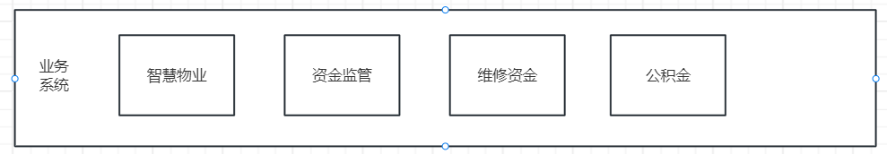
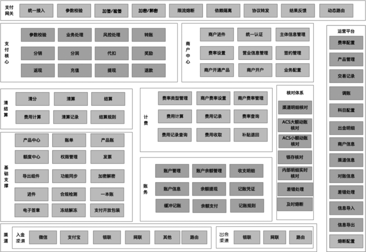

# 一、支付中心

## 背景

**当前住房板块各业务系统各自开发支付模块，各自为战，为了提升支付模块的稳定性、维护性、性能和扩展性，需要将支付模块独立出来，统一为其他业务系统提供支付能力;**

支付中心架构将各业务的公共交易、支付、财务等沉淀到支付中心，并主要解决了以下三个主要问题：

1. 建立基础订单、支付、财务统一体系，抽象和封装公共处理逻辑，形成统一的基础服务，降低业务的接入成本 及重复研发成本；
2. 构建安全、稳定、可扩展的系统，为业务的快速发展和创新需求提供基础支撑，解决业务「快」和支付「稳」之间的矛盾；
3. 沉淀核心交易数据，同时为风控提供数据支撑。

## 业务场景说明

### 支付结算场景

### 1.维修资金系统支付结算需求

- 维修资金交款、退款、项目支用、资金划拨

角色：业主、开发商、维修资金中心

业主缴款：

小程序查询房屋、缴款单扫码下单->调用支付中心下单->支付->到账通知->记账->直接结算到维修资金中心

退款:

维修资金中心->退款->到账通知->记账->业主、开发商

支用：

维修资金中心->管理端资金转账->到账通知->记账->维修企业

### 2.智慧物业管理系统支付结算需求

物业系统为SaaS模式，B/S架构，使用平台公有云服务器，单独数据库分区，使用角色为平台合作的付费物业企业，支付结算需求包括：

- 物业费、车位管理费、电梯费等费项需根据后台账单生成支付订单，且用户支付后直接结算至物业企业帐户，不做分成；
- 代收水电费需对接远程水电表设备，用户可在线预充费用，并随时查看余额，用户充值金额结算至物业企业帐户，并定期结算给当地水、电主管部门；
- 业主报修工单支付费用需按照材料费、工时费区分账单，直接结算至物业企业帐户，且平台收取3%的服务费；
- 物业结算金额需满足“T+1”到账，即次日（工作日）到账；
- 所有订单支持后台手动操作退款。

角色：物业服务公司、水利局、电力局、业主、租客、停车访客、维修公司

物业费、车位管理费、电梯费：

业主缴款直接结算到物业企业账户

代收水电费：

### 3.商品房、存量房资金监管系统支付结算需求

- 监管账户划拨资金到开发商账户

角色：监管银行、开发商、住建局

商品房：

项目完成X期工->住建局批准->预售资金管理系统发起资金划拨->监管账户->开发商

监管账户->开发商

存量房：

买方->监管账户->卖方

### 4.公积金系统支付结算需求

汇缴:

单位批量汇缴->个人公积金账户

个人汇缴：

个人->支付->公积金账户

提取：

个人发起提取->公积金中心审批->资金划拨->

冲还贷：

定时任务发起还贷提取->资金划拨

## 业务架构

## 详细设计

### 网关层

#### 支付网关

### 业务层

#### 收银台

#### 客户中心

### 支付层

#### 支付核心

#### 账务核心

#### 清结算

### 运营平台

# 二、住房金融开放平台